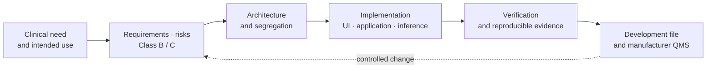
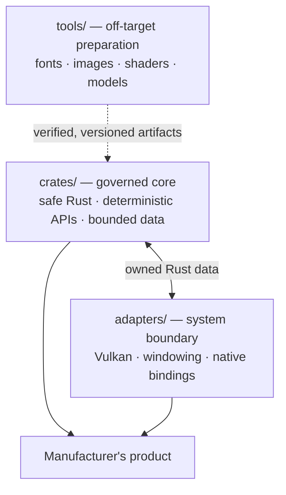

<p align="center">
  
</p>

# TrustSC

🇫🇷 [Version française](README.md)

**A software foundation for taking Class B or Class C medical-device software from its first
architectural decisions to the evidence expected throughout an IEC 62304 life cycle.**

TrustSC is a Rust framework for teams that want to build a complete medical-device software
product without postponing regulatory concerns until the prototype is finished. Safety
classification, software architecture, traceability, risk management, verification,
configuration control, and document production are treated as project data and engineering
constraints from the outset. Code, design decisions, and evidence can therefore evolve within
the same controlled history.

TrustSC does not, by itself, make a device “compliant” or certified. It provides architecture,
components, and working practices intended to address regulatory uncertainty early and to feed
the manufacturer's quality management system. The precise boundary of that contribution is set
out in [Regulatory compliance](docs/regulatory-compliance.md).

## Life-cycle concerns shape the architecture

Documentation is not a retrospective account of development in TrustSC. Requirements, risks,
verification cases, architectural decisions, and generated artifacts all have versioned
representations that can be checked in code and used in the software development file.



The aim is to preserve this continuity from the first prototype to the maintained product. A
significant decision should be traceable to a requirement, a risk, a verification activity, and
supporting evidence, rather than reconstructed shortly before an audit.

## Available today

### Deterministic UI and Vulkan integration

- A Rust UI model for Class B and Class C software, with Vulkan and Vulkan SC profiles.
- The declarative `.medui` language, compiled at build time: no DSL parsing, layout solving, or
  text shaping takes place on the target.
- Statically structured medical UI components—including numeric displays, status indicators,
  panels, images, critical buttons, bounded text fields, and Vulkan views—whose resources and
  interactions are budgeted in advance.
- A `trustsc-vulkan-winit` adapter that owns the Vulkan instance, device, swapchain, pipelines,
  and event loop without exposing native types to the governed core.
- Off-screen rendered-truth verification for placement, bounds, localized text, and critical
  states.

The Vulkan path runs today. The Vulkan SC profile already enforces its constraints in the APIs
and can be previewed on a development workstation; an adapter to the actual Vulkan SC driver is
still required for each production target. This boundary is deliberate: a Vulkan SC host preview
is not qualification of the final graphics stack.

### Inference organized for Class C architectures

TrustSC separates model preparation from model execution. Weights are imported and compiled off
target, then shipped as an immutable, verified package. The reference on-device engine,
`trustsc-ml-runtime`, is written in safe Rust, links neither ONNX Runtime nor PyTorch, performs no
allocation during inference, and uses a fixed evaluation order. At initialization it replays
golden vectors and fails closed if any result differs bit for bit.

This arrangement makes it possible to place inference within a Class C architecture while
keeping three distinct evidence subjects separate: engine code, model structure, and weights
qualified by the manufacturer. It does not remove the need to qualify the data or clinically
validate the intended use.

### Traceability and document production

- `trustsc-governance` models requirements, hazards, verification cases, problem reports, and
  audit events, and can produce a trace matrix and audit trail.
- Fonts, images, shaders, and models share a deterministic `bake`/`verify` process. Packages and
  SHA-256 reports are versioned and rechecked byte for byte in continuous integration.
- [`software_development_file/`](software_development_file/README.md) contains manufacturer
  templates and the corresponding TrustSC records for architecture, design, SOUP, risk,
  usability, and cybersecurity.
- The [`docs/iec62304/`](docs/iec62304/README.md), [`docs/iso13485/`](docs/iso13485/README.md),
  [`docs/iso14971/`](docs/iso14971/README.md), [`docs/iec62366/`](docs/iec62366/README.md), and
  [`docs/iec81001/`](docs/iec81001/README.md) corpus provides clause navigation and original
  explanatory prose without reproducing protected standards text.
- The [SOUP register](docs/governance/soup-register.toml) records third-party dependencies, their
  provenance, purpose, architectural containment, and associated risk controls.

These outputs are designed to become controlled inputs to the manufacturer's QMS and technical
documentation. Taken alone, they are not an operating quality system.

## Three trust zones



This split does not claim that any part of the software is exempt from review. It makes the
boundaries explicit: the core subject to the strongest rules stays small and forbids `unsafe`,
native bindings remain confined to adapters, and complex authoring tools are not shipped in the
embedded executable. The rationale is recorded in the
[architecture decision records](docs/adr/README.md).

## Demonstration and getting started

`class_c_monitor` applies these principles in the **NeuroSense 500**, a fictional
depth-of-anesthesia monitor with a real-time medical screen, 3D view, bounded interactions,
traceability, and on-device inference. It is an architectural demonstrator, not a validated
device or clinical model.

```bash
source $HOME/.cargo/env

cargo build --locked --workspace
cargo test --locked --quiet
cargo run -p hello_world
cargo run -p hello_world -- --headless-smoke
cargo run -p class_c_monitor
```

Vulkan installation and detailed walkthroughs are covered in
[Getting started](docs/getting-started.md).

## Intended scope

TrustSC is intended to extend beyond UI infrastructure. The following areas describe a direction
of travel; they are not yet provided by this repository and each will require its own
architecture, risk analysis, and evidence criteria.

| Area | Intended outcome |
|---|---|
| Assisted regulatory documentation | Produce and maintain documents from controlled sources, with reference traceability and human approval. The architecture remains to be evaluated: RAG, MCP, specialized models, or a combination of these approaches. |
| Clinical-study data | Organize acquisition, provenance, checking, freezing, and use of data for studies and validation. |
| Export and hospital interoperability | Provide controlled export mechanisms and hospital-network connectors, addressing security, privacy, and traceability by design. |
| Embedded Yocto distribution | Generate a reproducible, documented distribution with isolated virtual machines and CPU-core assignment consistent with the system's architectural segregation. |
| Operating-system-free targets | Define profiles and adapters for bare-metal deployments where footprint, determinism, or the safety architecture requires them. |

## Responsibility boundary

The manufacturer remains responsible for intended use, classification, risk management, tool and
supplier qualification, validation—including clinical validation—product cybersecurity, the QMS,
and engagement with the notified body. TrustSC provides technical and documentary foundations for
those activities; it does not replace them.

## Documentation

- [Documentation home](docs/README.md)
- [Regulatory compliance](docs/regulatory-compliance.md)
- [Architecture](docs/architecture.md)
- [Software development file](software_development_file/README.md)
- [MedUI DSL reference](docs/dsl/overview.md)
- [Architecture decision records](docs/adr/README.md)

**License**: to be finalized.
