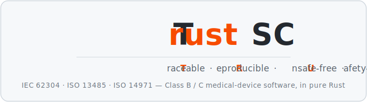
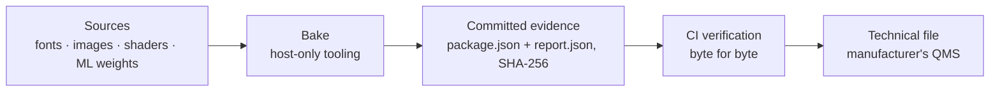
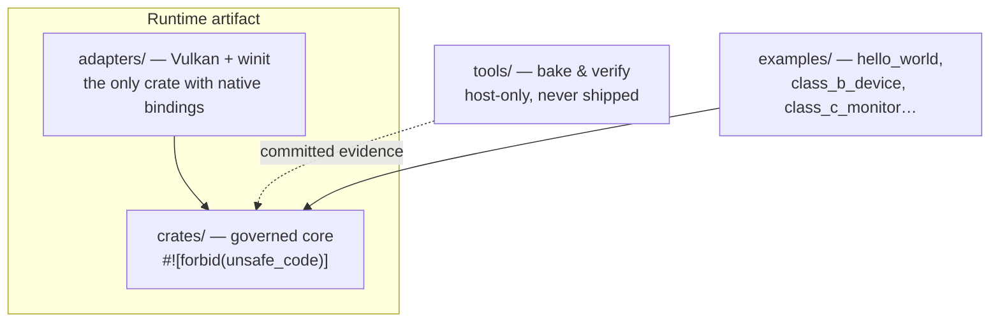

<p align="center">
  
</p>

<p align="center">🇫🇷 <a href="README.md">Version française</a></p>

# TrustSC

**Class B/C medical-device software, without hand-maintained compliance.**

TrustSC is a pure-Rust framework for building software aligned with IEC 62304, ISO 13485, and
ISO 14971. Traceability, evidence, and the safety-critical UI are not documents written after
the fact: they are generated by tooling, versioned with the code, and re-verified on every
commit.

## Regulatory complexity has a tooled answer

- **Traceability drifting from the code?** The `Requirement`, `Hazard`, `VerificationCase`, and
  `AuditEvent` types in `trustsc-governance` live in the code and export the trace matrix and
  audit trail.
- **A SOUP list exploding in the UI and AI layers?** A Vulkan (Class B) / Vulkan SC (Class C) UI
  and on-device ML inference written in Rust with zero third-party dependencies — no SOUP
  exactly where it costs the most.
- **Evidence an auditor can't reproduce?** Every generated artifact carries its own SHA-256
  digest and is byte-verified in CI.
- **A technical file to assemble?** [`software_development_file/`](software_development_file/README.md)
  provides the templates — plus the filled-in version for TrustSC itself — and a SOUP register
  in the expected shape.

## The evidence pipeline



Every asset is baked into committed evidence, then re-checked automatically — never asserted by
hand. Swapping a demonstration ML model for clinically-qualified weights changes zero lines of
inference code, and the engine refuses to start if its golden self-test doesn't reproduce
bit-for-bit.

## Quick start

```bash
cargo build                                  # build everything
cargo test                                   # run all tests
cargo run -p hello_world                     # simplest example (opens a Vulkan window)
cargo run -p hello_world -- --headless-smoke # no window, no Vulkan — for CI
cargo run -p class_c_monitor                 # NeuroSense 500: 3D UI + zero-SOUP ML
```

`class_c_monitor` launches the **NeuroSense 500**, a fictional depth-of-anesthesia monitor —
the full demonstration: safety-critical 3D UI and zero-SOUP ML inference. Vulkan setup and
detailed walkthroughs: **[Getting started](docs/getting-started.md)**.

## Three trust zones



Review effort concentrates where it matters: a small governed core free of `unsafe`, native
bindings isolated in a single adapter, tooling that never ships in a runtime artifact.

## For notified bodies

A small review perimeter, reproducible evidence, a SOUP register
([`docs/governance/soup-register.toml`](docs/governance/soup-register.toml)) already in
technical-file shape, and 21 ADRs documenting every design boundary. What the project provides —
and does not provide — is stated explicitly in
**[Regulatory compliance](docs/regulatory-compliance.md)**.

## Documentation

- **[Documentation home](docs/README.md)**
- **[Regulatory compliance](docs/regulatory-compliance.md)** — IEC 62304, notified bodies, the
  evidence mechanism, honestly-stated scope limits.
- **[Architecture](docs/architecture.md)** — trust zones, crate map, CI.
- **[Getting started](docs/getting-started.md)** — setup, example walkthroughs.
- **[Architecture decision records](docs/adr/README.md)** — the 21 accepted ADRs.
- **[MedUI DSL reference](docs/dsl/overview.md)** — the `.medui` compile-time UI language.

---

TrustSC is a framework and a set of compliance APIs — not a certified medical device, and not a
substitute for a manufacturer's own QMS and engineering judgment.

**License**: to be finalized.
