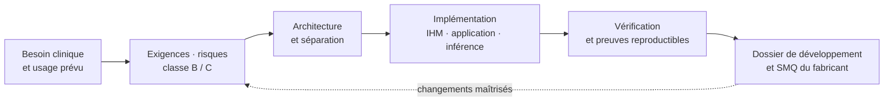
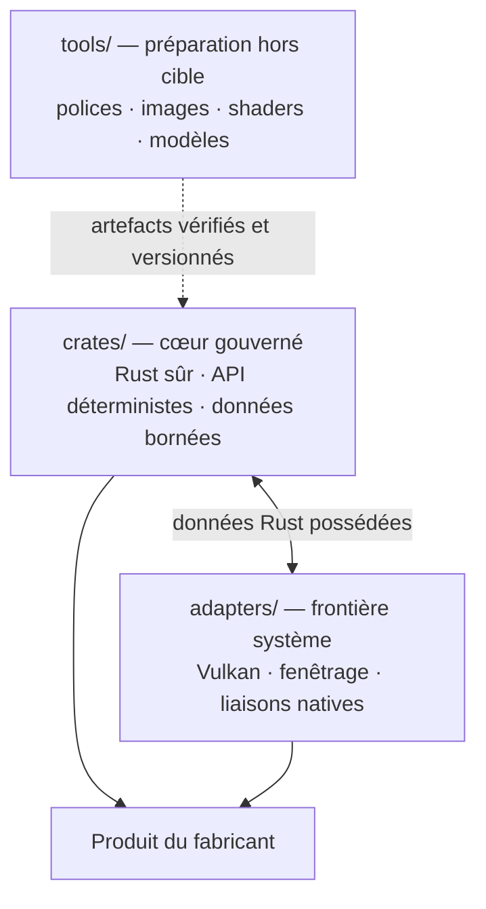

<p align="center">
  
</p>

# TrustSC

🇬🇧 [English version](README.en.md)

**Un socle logiciel pour conduire le développement d'un dispositif médical de classe B ou C,
depuis les premiers choix d'architecture jusqu'aux éléments de preuve attendus dans un cycle de
vie IEC 62304.**

TrustSC est un socle de développement en Rust destiné aux équipes qui veulent construire un
produit logiciel complet sans remettre les sujets réglementaires à la fin du prototype.
Classification de sûreté,
architecture logicielle, traçabilité, gestion des risques, vérification, maîtrise des éléments de
configuration et production documentaire sont traitées comme des données et des contraintes du
projet dès son origine. Le code, les décisions de conception et les preuves évoluent ainsi dans le
même historique contrôlé.

TrustSC ne rend pas, à lui seul, un dispositif « conforme » ou certifié. Il fournit une architecture,
des composants et une organisation de travail conçus pour réduire très tôt les incertitudes
réglementaires et pour alimenter le système de management de la qualité du fabricant. Le périmètre
exact de cette contribution est décrit dans [Conformité réglementaire](docs/regulatory-compliance.md).

## Le cycle de vie comme principe d'architecture

Dans TrustSC, la documentation n'est pas une restitution tardive du développement. Les exigences,
les risques, les cas de vérification, les choix d'architecture et les artefacts générés ont des
représentations versionnées, contrôlables par le code et exploitables dans le dossier de
développement logiciel.



L'ambition est de préserver cette continuité du premier prototype jusqu'au produit maintenu : une
décision importante doit pouvoir être reliée à une exigence, à un risque, à une vérification et à
un élément de preuve, plutôt que reconstituée au moment d'un audit.

## Ce qui est disponible aujourd'hui

### IHM déterministe et intégration Vulkan

- Un modèle d'IHM en Rust pour les logiciels de classes B et C, avec profils Vulkan et Vulkan SC.
- Le langage déclaratif `.medui`, compilé à la construction : ni analyse du DSL, ni résolution de
  mise en page, ni mise en forme de texte n'ont lieu sur la cible.
- Des composants médicaux à structure statique — affichages numériques, états, panneaux, images,
  boutons critiques, champs bornés et vues Vulkan — dont les ressources et les interactions sont
  dimensionnées à l'avance.
- Un adaptateur `trustsc-vulkan-winit` qui prend en charge l'instance, le périphérique, la chaîne de
  présentation, les pipelines et la boucle d'événements Vulkan, sans exposer de types natifs au
  cœur gouverné.
- Une vérification hors écran de la « vérité rendue », destinée notamment aux positions, aux
  emprises, aux textes localisés et aux états critiques.

Le chemin Vulkan est exécutable aujourd'hui. Le profil Vulkan SC impose déjà ses contraintes dans
les API et peut être prévisualisé sur un poste de développement ; l'adaptateur vers un pilote
Vulkan SC réel demeure nécessaire pour chaque cible de production. Cette distinction est
volontairement explicite : une prévisualisation Vulkan SC n'est pas une qualification de la chaîne
graphique finale.

### Inférence embarquée organisée pour la classe C

TrustSC sépare la préparation d'un modèle et son exécution. Les poids sont importés et compilés hors
cible, puis livrés sous la forme d'un paquet immuable et vérifié. Le moteur embarqué de référence,
`trustsc-ml-runtime`, est écrit en Rust sûr, sans ONNX Runtime ni PyTorch, sans allocation pendant
l'inférence et avec un ordre de calcul fixé. À son initialisation, il rejoue des vecteurs de
référence et refuse de démarrer si les résultats divergent bit à bit.

Cette organisation permet d'intégrer un moteur d'inférence dans une architecture de classe C sans
confondre trois objets qui demandent des preuves différentes : le code du moteur, la structure du
modèle et les poids qualifiés par le fabricant. Elle ne dispense évidemment ni de la qualification
des données, ni de la validation clinique de l'usage prévu.

### Traçabilité et production documentaire

- `trustsc-governance` modélise les exigences, dangers, cas de vérification, rapports de problème
  et événements d'audit, puis produit une matrice de traçabilité et une piste d'audit.
- Les polices, images, shaders et modèles suivent un même processus déterministe de
  `bake`/`verify`. Les paquets et leurs rapports d'empreinte SHA-256 sont versionnés puis revérifiés
  octet par octet en intégration continue.
- [`software_development_file/`](software_development_file/README.md) contient des trames à
  compléter par le fabricant et leur mise en œuvre pour TrustSC : architecture, conception,
  SOUP, risques, utilisabilité et cybersécurité.
- Le corpus [`docs/iec62304/`](docs/iec62304/README.md), [`docs/iso13485/`](docs/iso13485/README.md),
  [`docs/iso14971/`](docs/iso14971/README.md), [`docs/iec62366/`](docs/iec62366/README.md) et
  [`docs/iec81001/`](docs/iec81001/README.md) fournit des repères de clauses et une prose originale
  exploitable sans reproduire le texte protégé des normes.
- Le [registre SOUP](docs/governance/soup-register.toml) rassemble les dépendances tierces, leur
  provenance, leur usage, leur confinement architectural et les mesures de maîtrise associées.

Ces sorties sont faites pour devenir des entrées contrôlées du SMQ et du dossier technique. Elles
ne constituent pas, isolément, un système qualité opérationnel.

## Trois zones de confiance



Le découpage ne prétend pas soustraire une partie du logiciel à la revue. Il rend explicites les
frontières : le cœur régi par les contraintes les plus fortes reste restreint et interdit
`unsafe`, les liaisons natives sont confinées dans les adaptateurs, et l'outillage complexe ne se
retrouve pas dans l'exécutable embarqué. Les raisons de ces choix sont consignées dans les
[décisions d'architecture](docs/adr/README.md).

## Démonstration et prise en main

`class_c_monitor` met ces principes en œuvre dans le **NeuroSense 500**, moniteur fictif de
profondeur d'anesthésie : écran médical temps réel, vue 3D, interactions bornées, traçabilité et
inférence embarquée. Il s'agit d'un démonstrateur d'architecture, non d'un dispositif ou d'un
modèle clinique validé.

```bash
source $HOME/.cargo/env

cargo build --locked --workspace
cargo test --locked --quiet
cargo run -p hello_world
cargo run -p hello_world -- --headless-smoke
cargo run -p class_c_monitor
```

L'installation de Vulkan et les parcours détaillés figurent dans le guide
[Getting started](docs/getting-started.md) (en anglais).

## Périmètre visé

TrustSC est appelé à dépasser le seul cadre de l'IHM. Les chantiers suivants constituent une
orientation de travail ; ils ne sont pas encore fournis par le dépôt et devront chacun faire
l'objet d'une architecture, d'une analyse de risques et de critères de preuve propres.

| Chantier | Finalité envisagée |
|---|---|
| Documentation réglementaire assistée | Produire et maintenir des documents à partir de sources contrôlées, avec traçabilité des références et validation humaine. L'architecture reste à instruire : RAG, MCP, modèles spécialisés ou combinaison de ces approches. |
| Données d'études cliniques | Organiser l'acquisition, la provenance, le contrôle, le gel et l'exploitation des données utilisées pour les études et la validation. |
| Export et interopérabilité hospitalière | Fournir des mécanismes d'export maîtrisés et des connecteurs vers le réseau de l'établissement, en intégrant dès la conception sécurité, confidentialité et traçabilité. |
| Distribution embarquée Yocto | Générer une distribution reproductible et documentée, avec machines virtuelles isolées et affectation de cœurs cohérente avec la séparation architecturale des fonctions. |
| Cibles sans système d'exploitation | Définir des profils et adaptateurs pour les déploiements directement sur matériel (« bare metal ») lorsque l'empreinte, le déterminisme ou l'architecture de sûreté l'exigent. |

## Limites de responsabilité

Le fabricant demeure responsable de l'usage prévu, de la classification, de la gestion des
risques, de la qualification des outils et fournisseurs, de la validation — notamment clinique —,
de la cybersécurité du produit, du SMQ et des échanges avec l'organisme notifié. TrustSC fournit
une assise technique et documentaire à ces activités ; il ne s'y substitue pas.

## Documentation

- [Accueil de la documentation](docs/README.md)
- [Conformité réglementaire](docs/regulatory-compliance.md)
- [Architecture](docs/architecture.md)
- [Dossier de développement logiciel](software_development_file/README.md)
- [Référence du DSL MedUI](docs/dsl/overview.md)
- [Décisions d'architecture](docs/adr/README.md)

**Licence** : à finaliser.
