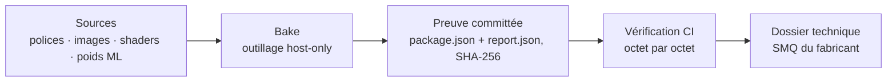
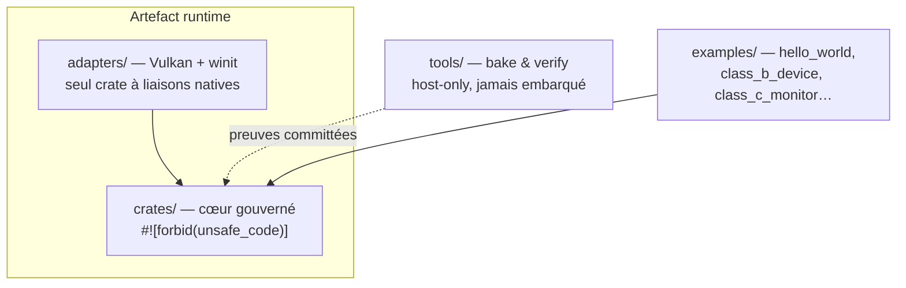

<p align="center">
  
</p>

<p align="center">🇬🇧 <a href="README.en.md">English version</a></p>

# TrustSC

**Le logiciel de dispositif médical Classe B/C, sans la conformité maintenue à la main.**

TrustSC est un framework 100 % Rust pour construire des logiciels alignés sur l'IEC 62304,
l'ISO 13485 et l'ISO 14971. La traçabilité, les preuves et l'IHM critique n'y sont pas des
documents rédigés après coup : elles sont générées par l'outillage, versionnées avec le code et
revérifiées à chaque commit.

## La complexité réglementaire a une solution outillée

- **La traçabilité diverge du code ?** Les types `Requirement`, `Hazard`, `VerificationCase` et
  `AuditEvent` de `trustsc-governance` vivent dans le code et exportent matrice de traçabilité
  et piste d'audit.
- **La liste SOUP explose dans l'UI et l'IA ?** IHM Vulkan (Classe B) / Vulkan SC (Classe C) et
  inférence ML embarquée écrites en Rust sans dépendance tierce — zéro SOUP là où elle coûte le
  plus cher.
- **Des preuves qu'un auditeur ne peut pas reproduire ?** Chaque artefact généré porte son
  empreinte SHA-256 et est revérifié octet par octet en CI.
- **Un dossier technique à assembler ?** [`software_development_file/`](software_development_file/README.md)
  fournit les templates — et leur version remplie pour TrustSC lui-même — plus un registre SOUP
  au format attendu.

## Le pipeline de preuves



Chaque asset est compilé en preuve committée, puis recontrôlé automatiquement — jamais affirmé à
la main. Remplacer un modèle ML de démonstration par des poids cliniquement qualifiés ne change
aucune ligne de code d'inférence, et le moteur refuse de démarrer si son auto-test de référence
ne se reproduit pas bit à bit.

## Démarrage rapide

```bash
cargo build                                  # tout compiler
cargo test                                   # exécuter tous les tests
cargo run -p hello_world                     # exemple le plus simple (ouvre une fenêtre Vulkan)
cargo run -p hello_world -- --headless-smoke # sans fenêtre, sans Vulkan — pour la CI
cargo run -p class_c_monitor                 # NeuroSense 500 : UI 3D + ML zéro-SOUP
```

`class_c_monitor` lance le **NeuroSense 500**, un moniteur de profondeur d'anesthésie fictif —
la démonstration complète : IHM critique 3D et inférence ML zéro-SOUP. Installation de Vulkan et
parcours détaillés : **[Getting started](docs/getting-started.md)** (en anglais).

## Trois zones de confiance



L'effort de revue se concentre là où il compte : un cœur gouverné restreint et sans `unsafe`,
des liaisons natives isolées dans un adaptateur unique, un outillage qui ne part jamais dans un
artefact runtime.

## Pour les organismes notifiés

Un périmètre de revue restreint, des preuves reproductibles, un registre SOUP
([`docs/governance/soup-register.toml`](docs/governance/soup-register.toml)) déjà au format d'un
dossier technique, et 21 ADR documentant chaque frontière de conception. Ce que le projet fournit
— et ne fournit pas — est énoncé explicitement dans
**[Conformité réglementaire](docs/regulatory-compliance.md)** (en anglais).

## Documentation

- **[Accueil de la documentation](docs/README.md)**
- **[Conformité réglementaire](docs/regulatory-compliance.md)** — IEC 62304, organismes notifiés,
  mécanisme de preuve, limites de portée assumées honnêtement.
- **[Architecture](docs/architecture.md)** — zones de confiance, cartographie des crates, CI.
- **[Getting started](docs/getting-started.md)** — installation, parcours des exemples.
- **[Architecture decision records](docs/adr/README.md)** — les 21 ADR acceptées.
- **[Référence du DSL MedUI](docs/dsl/overview.md)** — le langage `.medui` de description d'UI.

---

TrustSC est un framework et un ensemble d'API de conformité — pas un dispositif médical certifié,
ni un substitut au SMQ et au jugement d'ingénierie du fabricant.

**Licence** : à finaliser.
